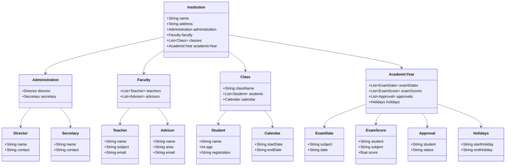

# School X Administration
### management of an educational institution

```mermaid
classDiagram
    class Institution {
        +String name
        +String address
        +Administration administration
        +Faculty faculty
        +List~Class~ classes
        +AcademicYear academicYear
    }

    class Administration {
        +Director director
        +Secretary secretary
    }

    class Director {
        +String name
        +String contact
    }

    class Secretary {
        +String name
        +String contact
    }

    class Faculty {
        +List~Teacher~ teachers
        +List~Advisor~ advisors
    }

    class Teacher {
        +String name
        +String subject
        +String email
    }

    class Advisor {
        +String name
        +String area
        +String email
    }

    class Class {
        +String className
        +List~Student~ students
        +Calendar calendar
    }

    class Student {
        +String name
        +int age
        +String registration
    }

    class Calendar {
        +String startDate
        +String endDate
    }

    class AcademicYear {
        +List~ExamDate~ examDates
        +List~ExamScore~ examScores
        +List~Approval~ approvals
        +Holidays holidays
    }

    class ExamDate {
        +String subject
        +String date
    }

    class ExamScore {
        +String student
        +String subject
        +float score
    }

    class Approval {
        +String student
        +String status
    }

    class Holidays {
        +String startHoliday
        +String endHoliday
    }

    Institution --> Administration
    Institution --> Faculty
    Institution --> Class
    Institution --> AcademicYear

    Administration --> Director
    Administration --> Secretary

    Faculty --> Teacher
    Faculty --> Advisor

    Class --> Student
    Class --> Calendar

    AcademicYear --> ExamDate
    AcademicYear --> ExamScore
    AcademicYear --> Approval
    AcademicYear --> Holidays
```
